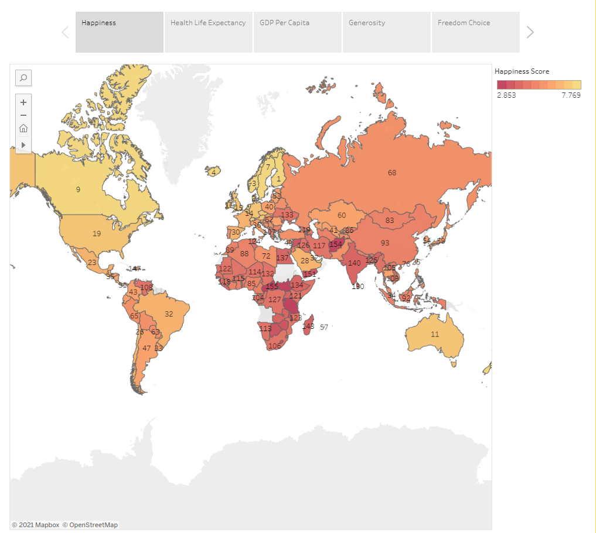

# Project-3 
## World Happiness

The World Hppiness Report is a Gallup World Poll survey of the state of global happiness that ranks 156 countries.
We used the 2019 report for Project 3. The 2019 data rankings used six key variables to determine the country rankings
of happiness.

### Data Sources:
World Happiness 2019 report
https://worldhappiness.report/ed/2019/

Kaggle
https://www.kaggle.com/unsdsn/world-happiness

### Libraries Used:
- Scikit-Learn
- Pandas
- Matplotlib
- Seaborn
- Tableau
- HTML/CSS/Bootstrap

### Models Performed:
- Linear Regression
- Logistic Regression
- Deep Learning

### Six Key Features:
1. GDP per capita
2. Healty life expectancy
3. Social Support
4. Freedom on life choices
5. Generosity
6. Perceptions of corruption